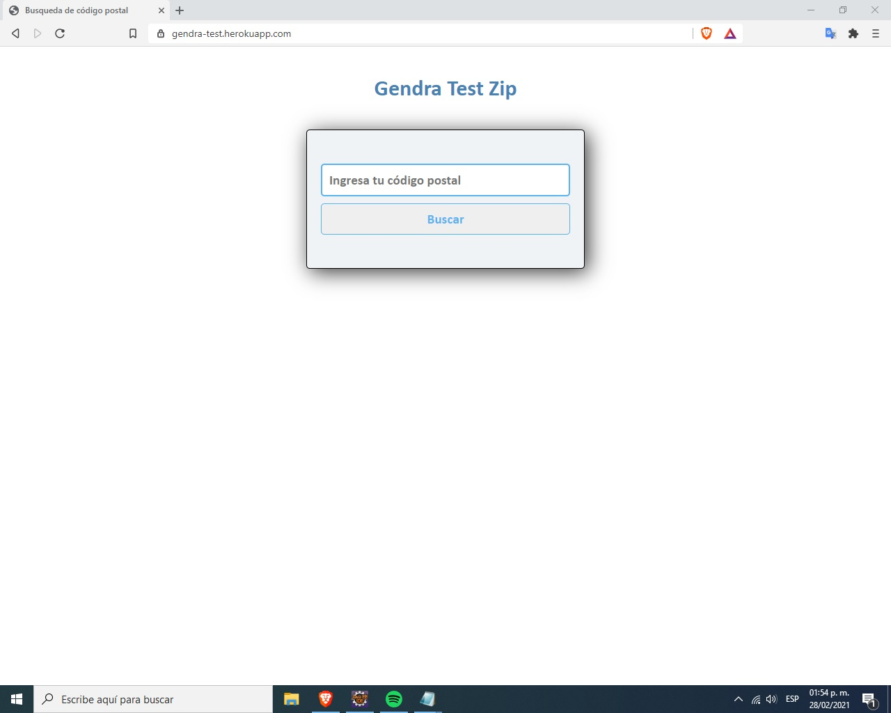
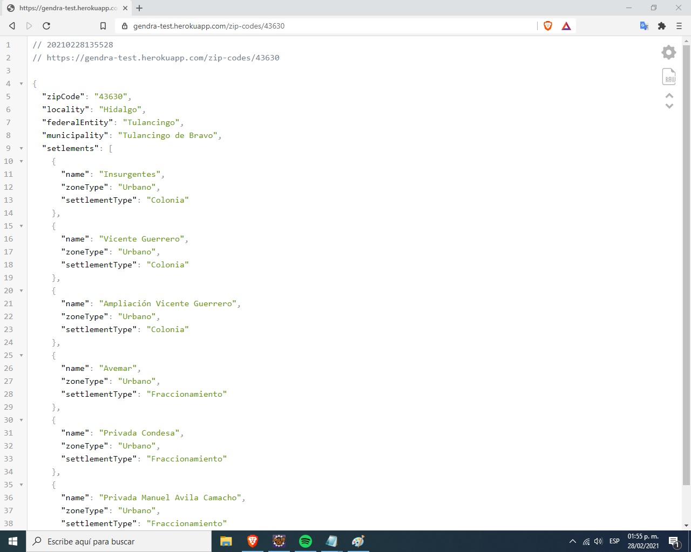
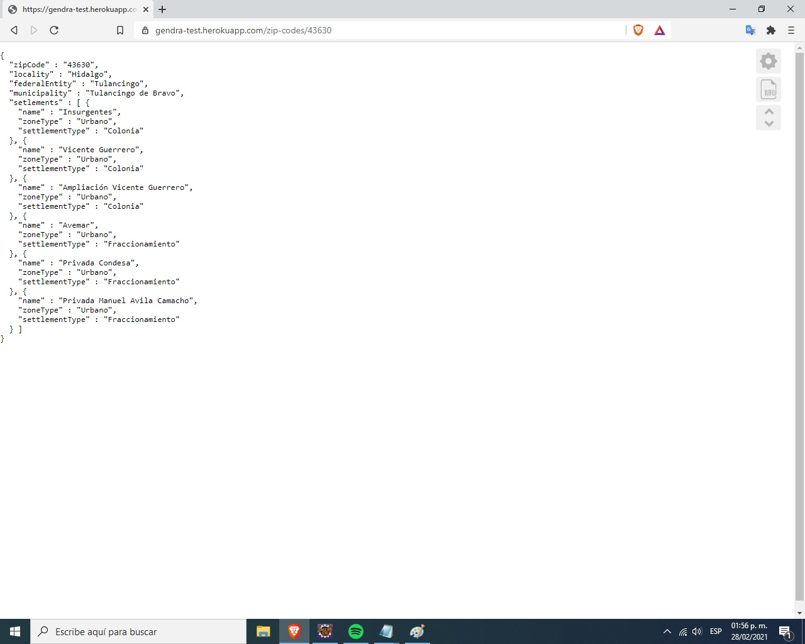

# Backend Coding Challenge

La prueba consiste en ingresar un código postal valido para México y devolver un resultado en formato Json.
La aplicacion se puede probar en la siguiente URL: https://gendra-test.herokuapp.com/

---

1. Colocar el código postal en el formulario.

---

2. El resultado se dara en formato Json, la siguiente imagen muestra el resultado con formato debido a la instalación de una extensión en el navegador llamado JSON Viewer.

---

3. En caso de no contar con esta extensión el resultado sera el siguiente.

